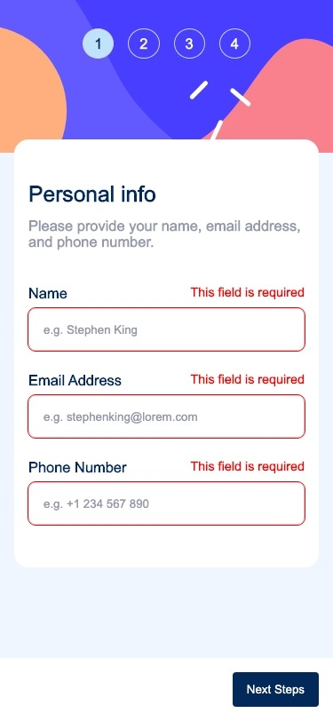

# Frontend Mentor - Multi-step form solution <!-- omit from toc -->

This project is a multi-step form with form validation, created as a challenge from [Frontend Mentor](https://www.frontendmentor.io/challenges/multistep-form-YVAnSdqQBJ). The goal was to build a form that not only collects and validates user input, but also dynamically changes based on the user's selections. This project was a significant challenge due to the complexity of managing state across multiple steps and rendering different form elements based on user input. 

## Table of contents <!-- omit from toc -->

- [Overview](#overview)
  - [The challenge](#the-challenge)
  - [Screenshot](#screenshot)
  - [Links](#links)
- [My process](#my-process)
  - [Built with](#built-with)
  - [What I learned](#what-i-learned)
  - [Continued development](#continued-development)
  - [Useful resources](#useful-resources)
- [Author](#author)

## Overview

### The challenge

The challenge involved creating a form with several distinct steps:

1. Personal Information: This step collects standard input fields such as name, email, and phone number. It includes validation for email and phone number patterns.

2. Plan Selection: This step allows users to select a plan and choose whether the plan is monthly or yearly. It uses a radio toggle-like interface for plan selection.

3. Add-Ons: This step presents users with a series of checkboxes to select add-ons. The available add-ons match the plan type selected in the previous step.

4. Summary: The final step displays a summary of the user's selections, including total costs and a list of add-ons. This step required significant logic to match user selections with data from a JSON file.

Despite the challenges, this project was a valuable opportunity to gain confidence in managing state across renders and working with complex form logic.

### Screenshot

### Links

- Solution URL: [View solution URL here](https://your-solution-url.com)
- Live Site URL: [View live site URL here](https://your-live-site-url.com)

## My process

### Built with

This project was constructed using a combination of powerful technologies:

- React.js: This is a JavaScript library renowned for its efficiency in building interactive user interfaces. It's especially useful for single-page applications where you need fast, seamless updates and rendering of components without requiring a page reload.

- Next.js: This is a framework for React that provides additional features not available in standalone React applications. It's particularly useful for server-side rendering and generating static websites, which can significantly improve performance and SEO.

- SCSS: This is a CSS preprocessor that allows developers to use variables, nested rules, mixins, functions, and more, all with a fully CSS-compatible syntax. It helps in writing more maintainable, easy-to-share CSS.

### What I learned

This project was a significant learning journey, where I delved deep into managing state across multiple components and dealing with complex form logic. Here's a breakdown of my key learnings:

- Form Validation: I learned how to create and validate various types of form inputs, including standard text inputs, radio buttons, and checkboxes. This involved ensuring that the data entered by users was in the correct format and providing feedback when it wasn't.

- Dynamic Rendering: I learned how to dynamically render different parts of the form based on the user's input. This was particularly important in the plan selection and add-on steps, where the options available to the user depended on their previous choices.

- Data Matching: I learned how to match user selections with data from a JSON file to generate a summary of the user's selections. This involved careful management of state and props to ensure that the data flowed correctly between components.

One feature I'm particularly proud of is the shaking animation that triggers when a user's input is invalid. This small detail enhances the user experience by providing immediate, intuitive feedback.

### Continued development

Looking ahead, I plan to continue refining my code. While I'm proud of the functionality I've achieved, I recognize that the code can be cleaner and more streamlined. My goal is to improve its readability and maintainability, making it easier for others (and my future self) to understand, modify, and build upon.

### Useful resources

- React Documentation: The official React documentation is a comprehensive resource that helped me understand the nuances of state and props management in React.

- Next.js Documentation: The Next.js documentation is a detailed guide that helped me leverage the powerful features of this React framework.

- SCSS Documentation: The SCSS documentation is a great resource for understanding the capabilities of this CSS preprocessor and how to use it to write more maintainable CSS.

## Author

- Github - [@blazeshomida](https://www.your-site.com)
- Frontend Mentor - [@shomidamoney](https://www.frontendmentor.io/profile/shomidamoney)
